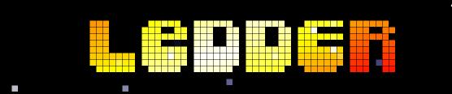
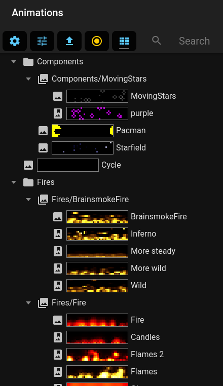
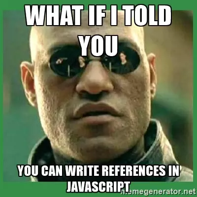

# Ledder

NOTE: We're currently processing the feedback from 38C3, so the project is going through a lot of changes and improvements right now.



Make cool animated pixel animations, and stream it to a led matrix display.

Control in realtime via a webgui.

LIVE DEMO: https://ledder.datux.nl

## Overview picture

Ledder can control leds in multiple ways:


# 38C3 megabanner info
We extended the matrix, so now its 8 x 92 .


Its probably at: http://151.217.6.18:3000/

Meet me at the HSNL for more info (the long table on the left front of the display).

We can write drivers for your project!

# Bornhack 2024 megabanner info


For Bornhack we've used a volleyball net a ledstring to create a 8 x 66 pixel banner that has a size of 80cm x 660cm

It can be easily rolled up to take to other camps.

I hope more people will create them so we can stack them together. :)

Ingredients:
 * Raspberry Pi Zero 2
 * Official volleybal net ( 10cm x 10cm grid size): https://sportnettenshop.nl/collections/online-volleybalnetten-bestellen-doe-je-hier-zeer-snelle-levering/products/volleybalnet-meest-eenvoudige-uitvoering
 * Led strings: https://nl.aliexpress.com/item/1005005551648167.html  (Choose transparent Big Led)
 * 600 tierips :)
 * Power supply. (It draws 32 A at max current)


## Hardware

### Easy, with WLED

You can just use the [WLED](https://kno.wled.ge/) project. (Ledder uses [DRGB mode](https://github.com/Aircoookie/WLED/wiki/UDP-Realtime-Control) )

Look in display display-example.js how to configure WLED. (Its the DisplayWLED driver)

In WLED you can configure the 2D matrix config to configure the display layout. 

### Advanced via Ledstream

If you want to control many ws2812 leds in realtime, the DRGB protocol isnt powerfull enough. Also WLED doesnt support updating multiple WS2812 ledstrips in parallel, and its sentitive to network jittering.

This is why we created [Ledsteam](https://github.com/psy0rz/ledstream) . 

The displayconf-example.js has examples on how to configure it. (Its the DisplayQOISudp driver)

### Advanced via raspberry

This is even more powerfull: Run ledder on a raspberry and connect up to 16 strips to the GPIO pins. (Uses DisplayRPI)

It depends on this module, install and test it first: [RPI-ws281x-smi](https://github.com/psy0rz/rpi-ws281x-smi)

NOTE: That module only works with a 32-bit OS! I'm using Rapsberry PI OS Lite 32-bit. (Debian bookworm/12)

Then, from the ledder directory run:
```console
npm i cmake-js
npm i ../rpi-ws281x-smi/
```

Use an example from displayconf-example.js to configure the DisplayRPI driver.

NOTE2: Since the pi probably doesnt have enough memory to build the vite-stuff, i usally run npm buildweb somewhere else and upload the result.

We really need a prebuilt docker image for this :)


### Pixelflut

(Currently broken, needs to be ported to new API. See DisplayPixelflut.ts)

## Quick start, without docker


First time:
```
npm install
npm run build
```

Installing/building takes long, but after that starting will be fast:

```
npm start
```

Go to http://localhost:3000



## Quicker start, with docker 

Just use
```
docker-compose up
```
Takes a while, since it also has to render the previews the first time.

Go to <http://localhost:3000> when its done.

## Control via MQTT

You can control ledder via mqtt, by starting the MQTT animation. In the controls of that animation you can specify mqtt host and topic.

The default will connect to our hackerspace mqtt, you can use it to test. (if it works :)

### Starting an animation

Use this topic: `ledder/select`:

Example:

```console
mosquitto_pub -h mqtt.hackerspace-drenthe.nl -t 'ledder/select' -m 'Text/Marquee/default'
```

### Getting controls for selected animation

Use this topic: `ledder/get`

Example:
```console
mosquitto_pub -h mqtt.hackerspace-drenthe.nl -t 'ledder/get' -m ''
```

MQTT output:
```
ledder/get (null)
ledder/state/Font {"selected":"C64"}
ledder/state/Font height {"value":0}
ledder/state/Font width {"value":0}
ledder/state/Text {"text":"Marquee  "}
ledder/state/Text color {"r":33,"g":255,"b":0,"a":1}
ledder/state/Stars/Enabled {"enabled":false}
ledder/state/Star field/Enabled {"enabled":false}
ledder/state/The Matrix/Enabled {"enabled":false}
ledder/state/Scrolling/Enabled {"enabled":true}
ledder/state/Scrolling/FPS {"value":60}
ledder/state/Scrolling/Rotate interval {"value":2}
ledder/state/Scrolling/Rotate interval randomizer {"value":0}
ledder/state/Scrolling/Rotate X step {"value":-1}
ledder/state/Font {"selected":"C64"}
ledder/state/Scrolling/Rotate Y step {"value":0}
ledder/state/Font height {"value":0}
ledder/state/Scrolling/Circular {"enabled":false}
...
```

### Setting a control

For example to change the text of the marquee animation:
```
mosquitto_pub -h mqtt.hackerspace-drenthe.nl -t 'ledder/set/Text' -m '{"text":"hello"}'
```


# Development

* Cool ledder stuff is under ledder/

* Webinterface stuff is under src/ Ignore it if you jusst want to play with leds and animations :)

Its much easier if you have a good editor that does good autocompletion. (Its the main reason i'm using Webstorm)

# Using ledder to create animations

## Pixels and colors

The most basic datastructures in ledder are Pixel() and Color() objects.

A Color() is what you expect and represents a color.

A Pixel() needs a color object and has an x and y coordinate.

```typescript
const color=new Color(255,0,0)
const pixel=new Pixel(3,3, color)
```

## Pixels lists

Just a list of pixels. Its actually just a Set() with extras.

They are very important and used for all kinds of things. Adding a pixel to a list:

```typescript
const pixels=new PixelList()
pixels.add(pixel)
```

A pixel list can even contain other pixel lists, so it becomes a pixel tree:
````typescript
const otherList=new PixelList()
otherList.add(new Pixel(1,1, color))
otherList.add(pixels)
otherList.print()
````

Use the print() function to see whats going on:
```
pixeltree:
 (1, 1) (r255, g0, b0, a1)
 pixeltree:
  (3, 3) (r255, g0, b0, a1)
```

Its setup this way so that we can add/remove sets of huge pixelLists and still have high performance. (Since you're only adding/removing references.)


## Everythings a reference

Its important to remember that variables in javascript are actually references to objects.



For example:
```typescript
let color1=new Color(255,0,0)
let color2=color1;
```
Now color1 and color2 both point to the same Color object. If you manipulate color1, then color2 will be changed as well.  

Ledder extensively makes use of this: If you add a pixel to a pixelList, you're actually adding a reference to that pixel.

If we run an effect on a Color-Object, that same color object is most likely used by multiple Pixels.

To create an actual copy you can use the copy() function on most objects.

## Animators

(Note: Before you start its usefull to have a good editor. I prefer Webstorm, but vscode works as well.) 

To actually do stuff you need to create an Animator class.

Use Template.ts as an example to start with.

The run() function of the animator is where it all happens:
```typescript
export default class Test extends Animator {

    async run(box: PixelBox, scheduler: Scheduler, controls: ControlGroup) {

        const color = new Color(255, 0, 0)
        const pixel = new Pixel(3, 3, color)
        box.add(pixel)

    }

}
```

It has THE 3 main parameters you will be working with:
* The box
* The scheduler
* The controls

### The box

A PixelBox is just a PixelList with extras: 

It has has minimum and maximum x and y coordinates, which you should stay within:
```typescript
console.log(box.xMin, box.xMax, box.yMin, box.yMax)
```

The main box is usually the one that is rendered to your Display and has the size of the display.

The size of the box is not enforced in any way, for performance and other reasons. 
So you still can add Pixels that are outside of it.

### The scheduler

The scheduler acts almost like setInterval and setTimeout. 
But its frame-based instead of time based. 

Use it to actually animate stuff.

An example of a moving pixel:

```typescript
export default class Test extends Animator {

    async run(box: PixelBox, scheduler: Scheduler, controls: ControlGroup) {

        const color=new Color(255,0,0)
        const pixel=new Pixel(3,3, color)
        box.add(pixel)

        scheduler.interval(1, ()=>
        {
            pixel.move(1,0)
            pixel.wrap(box)

        })

    }
}
```

Note that you can also call move() and wrap() on the box to move all the pixels that added to the box.

*NOTE: Dont use internal methods of the scheduler, they start with `__`*

### The controls

One awesome feature of ledder is that you can easily make stuff controllable by the user.

To make the example above fully controllable do something like this:

````typescript
export default class Test extends Animator {

    async run(box: PixelBox, scheduler: Scheduler, controls: ControlGroup) {

        const colorControl=controls.color('Main color')
        const controlY=controls.value('Y coordinate', 3, box.yMin, box.yMax , 1, true)
        const controlInterval=controls.value('Move interval', 1, 1,60)

        const pixel=new Pixel(0,controlY.value, colorControl)
        box.add(pixel)

        scheduler.intervalControlled(controlInterval, ()=>
        {
            box.move(1,0)
            box.wrap(box)

        })

    }
}

````

The use can now control your animation and even make presets! 
Some controls are realtime, while others will restart the animation if you change them. (by specifying true at the end)

*NOTE: Dont use the internal methods of the controls, they start with `__`*

#### Control types

Controls are very powerfull and are recursive as well. 
Look at the other animations how to use them optimally.

* control.value(): Just a number, with a minimum, maximum and step size.
* control.range(): A range between 2 numbers. 
* control.color(): Color selector
* control.switch(): On/off switch
* control.select(): Select box
* control.group(): Sub ControlGroup (recursively)
* control.input(): Text input


## Other stuff

You now know the core functions of ledder.

However, another goal of ledder is to make reusable components: Classes to draw boxes or create certain effects.


### Draw classes

In the draw-folder you'll find classes to "draw".

These are just PixelLists that fill themselfs with pixels.

E.g. to draw a rectangle:

```typescript
const rect = new DrawRectangle(0,0,3,3, color)
box.add(rect)

```

There are a bunch of really cool ones like DrawAsciiArt and DrawText. Look at other Animators how to use them. (The Logos for example)

Its also very easy to create new Draw-classes.

### FX classes

FX classes operate on existing PixelList() and Color() objects.

They can do some really awesome stuff, look at what the Marquee Animator can do for example.

The ledder-logo you see above is just a DrawText() combined with FxColorPattern(). 
I've just clicked around in the controls of the Marquee animator and took a screenshot. :)


## FAQ

### Previews are blank / I get weird proxy errors. 

If you do external async stuff, like loading files or getting an rss feed, take note:

The scheduler can run in realtime mode (60 fps usually) and "static" mode. 

Static mode is used to render previews and in the future it can even pre-render static animations.

In static mode the render is running as fast as possible: This means if your animation is awaiting for some external stuff, the rest of it will probably never run.

Its also possible that it tries to do stuff too late, when the animation is already aborted. In that case you will get an error like: ".get on revoked proxy object"

To fix this, call scheduler.stop() before doing that stuff, and scheduler.resume() when your done. 

(We use proxy objects to prevent interaction between a new animation and a previous one that still does async stuff)

Note that this will also happen when you use setInterval or setTimeout. Never use those in ledder!

### Which functions can i use to make animations?

You shouldn't use stuff that starts with __. Thats for internal use only. (In case of the scheduler and controls this is pretty clear.)

If you DO need them for some reason, you're either doing something wrong, or we need to fix/extend the API.

You can use everything explained here, and AnimationManager. (still have to document that, look at MQTT for an example)

We probably need to be more clear whats usable from animations and what is not. Stuff outside the ledder subdirectory is definitely off limits for animations.

You can offcourse use external npm modules and do regular nodejs stuff. 


