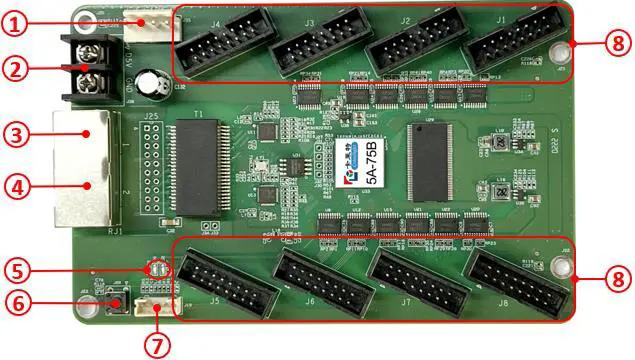

# Colorlight 5A-75B Hardware Guide

## Overview

The Colorlight 5A-75B is a powerful LED receiver card originally designed for commercial LED displays but widely adopted by the maker community for DIY LED projects.

## Hardware Specifications

### Core Components:
- **FPGA**: Lattice ECP5 LFE5U-25F-6BG381C (25K LUTs)
- **RAM**: 2× W9825G6KH-6 (32MB SDRAM total)
- **Flash**: 25Q32JVSIQ (4MB SPI Flash for firmware)
- **Ethernet**: 2× Realtek RTL8211FD Gigabit PHY
- **HUB75 Outputs**: 8 parallel outputs
- **Power**: 5V DC input, ~2A consumption
- **Dimensions**: 75mm × 50mm PCB

### Ethernet Ports:
- **3-ETH0 (Primary)**: Computer input connection - connect your computer here
- **4-ETH1 (Secondary)**: Pass-through for daisy-chaining multiple cards
- **Both ports**: Gigabit Ethernet capability

### HUB75 Interface Specifications:
- **Color Depth**: Up to 16-bit per color channel (RGB)
- **Scan Rates**: 1/2 to 1/32 (configurable per panel type)
- **Clock Speed**: Up to 25MHz pixel clock
- **Panel Support**: Indoor/outdoor LED matrices
- **Maximum per Output**: 64×64 pixels
- **Total Maximum**: 512×64 pixels (8 outputs × 64×64)

## Physical Layout



### PCB Component Reference:

**1. Power 1** - DC 3.8V~5.5V power supply connection (use only one power input)
**2. Power 2** - Alternative DC 3.8V~5.5V power supply connection (use only one power input)
**3. Network Port A (3-ETH0)** - Primary Ethernet connection for computer input
**4. Network Port B (4-ETH1)** - Secondary Ethernet connection for daisy-chaining/forwarding to next card
**5. Status LEDs:**
   - **Power Indicator (D1)** - Shows power status
   - **Signal Indicator (D2)** - Shows network/data activity
**6. Test Button** - Hardware test function (generates test pattern)
**7. External Interface** - Additional I/O connections
**8. HUB Pins** - HUB75 connector outputs for LED panels

### PCB Layout (Top-Left Section):
```
┌────────────────────────────────────────────────────────────────────────┐
│           [1-PWR]                                                      │
│ [2-PWR]            [8-HUB75-J4] [8-HUB75-J3] [8-HUB75-J2] [8-HUB75-J1] │
│                                                                        │
│ [3-ETH0] [J25] [T1]    [J30/J29]    [U33] [U34]                        │
│ [4-ETH1] [J25] [T2]    [J28/J27]                                       │
│                                                                        │
│         [5-LED]                                                        │
│ [6-TEST] [7-J19]   [8-HUB75-J5] [8-HUB75-J6] [8-HUB75-J7] [8-HUB75-J8] │
└────────────────────────────────────────────────────────────────────────┘

```

**PCB Layout Reference:**
- **Numbered components (n-NAME)**: Numbers 1-8 refer to the component reference list above
- **PCB designators (Unn, Jnn, Tnn)**: Uppercase letter + numbers are printed designators on the PCB itself
- **U33**: Main FPGA chip with "5A-75B" sticker label (center of PCB)
- **J30/J29/J28/J27**: JTAG programming interface test points
- **J19**: External interface connector (function unknown)
- **8-HUB75-Jn**: HUB75 connectors where J1-J8 are the PCB designators for each connector

**Component Identification:**
Refer to the numbered image above (`Colorlight-5A-75B-numbers.jpg`) for exact component locations on the PCB.

**Important Notes:**
- **Power**: Use only ONE power input (either 1 or 2, not both)
- **Network**: 3-ETH0 is primary input for computer connection, 4-ETH1 for daisy-chaining/forwarding
- **Test Function**: Button (6) works even without firmware flashing
- **Status LEDs**: D2 activity indicates compatible firmware is running

### JTAG Programming Header:
```

First read: https://github.com/kholia/Colorlight-5A-75B/blob/master/README.md. 

|-------|------|
| J30   | TDO  |
| J29   | TDI  |
| J28   | TMS  |
| J27   | TCK  |
|-------|------|


```

### HUB75 Connector Pinout:
```
Standard HUB75 16-pin IDC connector:
┌─────────────────────────────────┐
│ R1  G1  B1  GND  R2  G2  B2  E  │
│ A   B   C   D   CLK LAT  OE  GND│
└─────────────────────────────────┘

Signal descriptions:
- R1/G1/B1: Upper half RGB data
- R2/G2/B2: Lower half RGB data  
- A/B/C/D/E: Row address lines
- CLK: Pixel clock
- LAT: Latch signal
- OE: Output enable (brightness)
- GND: Ground connections
```

## Power Requirements

### Card Power Consumption:
- **Idle**: ~1A @ 5V (5W)
- **Active**: ~2A @ 5V (10W)
- **Peak**: ~2.5A @ 5V (12.5W)

### LED Panel Power (per 64×32 panel):
- **Black (off)**: ~0.2A @ 5V
- **Typical usage**: ~2-4A @ 5V
- **Full white**: ~6A @ 5V
- **Power connector**: Usually 5V barrel jack or terminal blocks

### Total System Power Calculation:
```
Example for 4× 64×32 panels:
- Card: 2A @ 5V = 10W
- Panels: 4 × 3A @ 5V = 60W
- Total: 14A @ 5V = 70W
- Recommended PSU: 80W+ @ 5V
```

## Performance Specifications

### Frame Rate Capabilities:
- **Maximum**: 120 FPS (depending on panel size and network)
- **Typical**: 60-90 FPS for moderate display sizes
- **Large displays**: 30-60 FPS (256×128+ pixels)
- **Latency**: <1ms over Ethernet connection

### Network Bandwidth Requirements:
```
Formula: Width × Height × 3 bytes × FPS + UDP overhead

Examples:
- 64×32 @ 60 FPS: ~368 KB/s
- 64×64 @ 60 FPS: ~737 KB/s  
- 128×64 @ 60 FPS: ~1.47 MB/s
- 256×128 @ 30 FPS: ~2.95 MB/s
```

### System Limitations:
- **HUB75 Outputs**: Maximum 8 per card
- **FPGA Resources**: Limits very high resolutions
- **Network Bandwidth**: Gigabit Ethernet recommended for large displays
- **Panel Timing**: Must match scan rate requirements (1/8, 1/16, 1/32)

### Configuration Capabilities:
- **Color Depth**: 24-bit RGB (8 bits per channel)
- **Brightness Control**: Via gamma mapping (0-255 range)
- **Gamma Correction**: Automatic hardware correction
- **Coordinate Mapping**: FlipX/FlipY transformations supported

## Thermal Considerations

### Operating Temperature:
- **Range**: 0°C to 70°C
- **Optimal**: 20°C to 40°C
- **Critical components**: FPGA, Ethernet PHYs

### Cooling Requirements:
- **Passive**: Adequate for most applications
- **Active**: Recommended for high-density installations
- **Airflow**: Ensure ventilation around FPGA

## Hardware Versions

### Version Identification:
Look for PCB markings near the power connector:
- **v7.0**: Older revision, some component variations
- **v8.0**: Current revision, most common
- **Differences**: Minor component changes, same functionality

### Version-Specific Notes:
- **v7.0**: May require specific firmware builds
- **v8.0**: Standard firmware compatibility
- **Both**: Same pinouts and electrical specifications

## Compatible LED Panels

### Supported Panel Types:
| Size | Scan Rate | Indoor/Outdoor | Typical Use |
|------|-----------|----------------|-------------|
| 32×32 | 1/8 | Indoor | Small displays |
| 64×32 | 1/16 | Indoor | Most common |
| 64×64 | 1/32 | Indoor/Outdoor | High resolution |
| 128×32 | 1/16 | Indoor | Wide format |
| 128×64 | 1/32 | Outdoor | Large displays |

### Panel Selection Criteria:
- **Pixel Pitch**: 2.5mm to 10mm typical
- **Brightness**: 300-5000 nits depending on application
- **Scan Rate**: Must match firmware configuration
- **Power**: Consider total system power budget

## Electrical Specifications

### Input/Output Characteristics:
- **Logic Levels**: 3.3V CMOS
- **Current Drive**: 24mA per output
- **Input Impedance**: High-Z CMOS inputs
- **ESD Protection**: Built-in protection diodes

### Signal Integrity:
- **Maximum Cable Length**: 30cm for HUB75 cables
- **Impedance**: 50Ω differential for Ethernet
- **Grounding**: Common ground for all connections

## Installation Guidelines

### Mechanical Mounting:
- **Mounting Holes**: 4× M3 holes in corners
- **Clearance**: 5mm minimum around connectors
- **Orientation**: Any orientation acceptable
- **Vibration**: Consider shock mounts for mobile applications

### Cable Management:
- **HUB75 Cables**: Keep short and well-secured
- **Ethernet**: Use quality Cat5e/Cat6 cables
- **Power**: Separate power and data cables
- **Strain Relief**: Use proper cable management

## Environmental Specifications

### Operating Conditions:
- **Temperature**: 0°C to +70°C
- **Humidity**: 10% to 90% non-condensing
- **Altitude**: Up to 2000m
- **Vibration**: 10G operational

### Storage Conditions:
- **Temperature**: -20°C to +85°C
- **Humidity**: 5% to 95% non-condensing
- **ESD Sensitivity**: Handle with anti-static precautions

## Safety Considerations

### Electrical Safety:
- **Power Supply**: Use certified 5V power supplies
- **Current Rating**: Ensure adequate current capacity
- **Fusing**: Consider input fusing for protection
- **Isolation**: Maintain proper electrical isolation

### Fire Safety:
- **Ventilation**: Ensure adequate airflow
- **Materials**: Use flame-retardant enclosures
- **Monitoring**: Consider temperature monitoring
- **Emergency Shutdown**: Plan for emergency power cutoff

## Compliance & Certifications

### Standards Compliance:
- **EMC**: Designed for EMC compliance (verify with enclosure)
- **Safety**: Low voltage safety standards
- **RoHS**: Component compliance varies by supplier

### Regulatory Notes:
- **FCC**: May require certification for commercial use
- **CE**: European conformity may be required
- **Local**: Check local regulations for LED displays

---

**⚠️ Important:** Always verify electrical specifications and power requirements before connecting panels. Inadequate power supplies are the most common cause of problems with LED displays.
